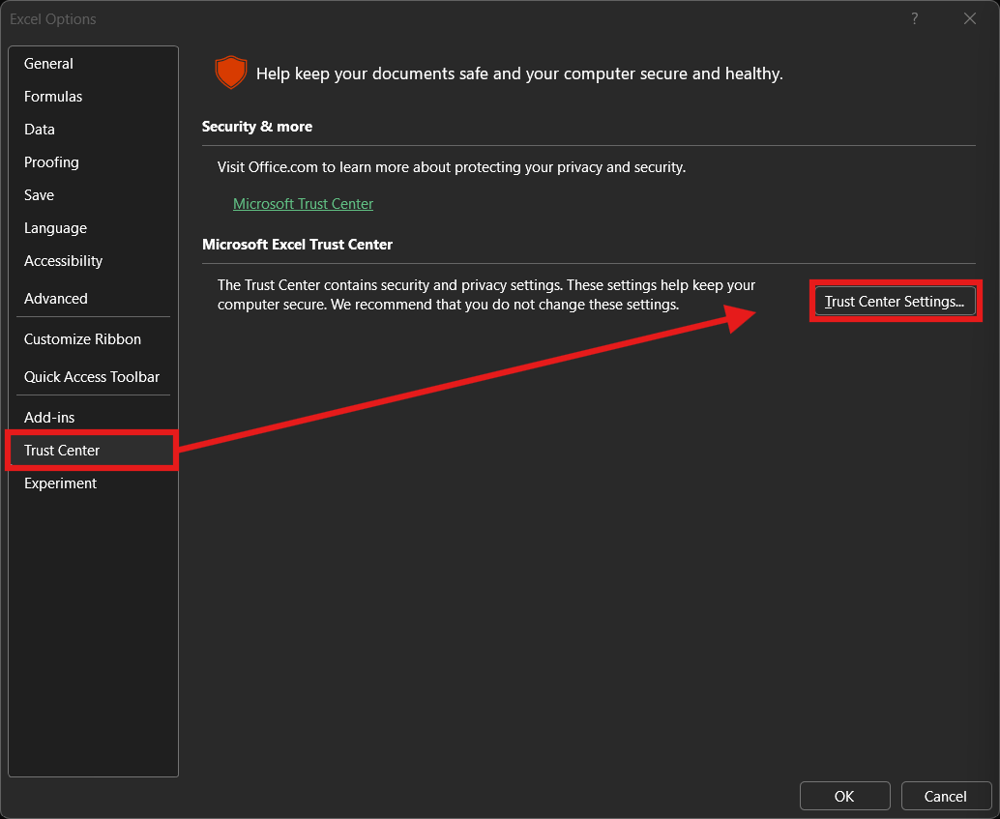
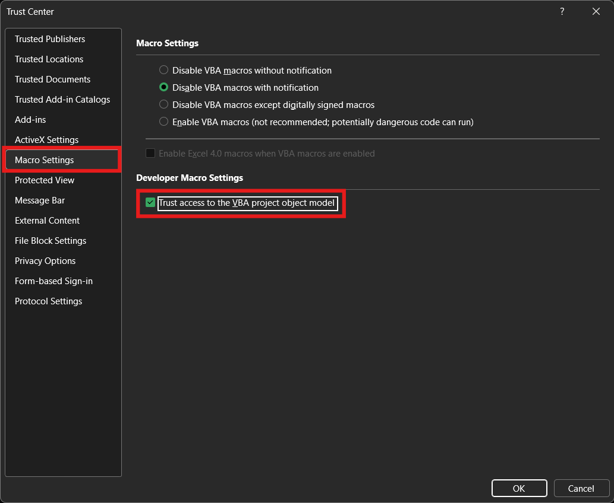

# README

## Contents

- [What is this?](#what-is-this)
- [Quick Start](#quick-start)
- [Macro loader](#macro-loader)

## What is this?

Additional behavior can be added to some Windows applications such as  
Excel in the form of macros. Macros can be saved in a macro-enabled  
Excel Workbook (`*.xlsm`) or globally within the `PERSONAL.XSLB`. A  
better approach is to save an Excel workbook (`*xlsx`) as an Excel  
Add-in (`*xlam`) under `%APPDATA%/Microsoft/Excel/XLSTART/` which  
makes the macros available globally.

With all these approaches, the macros are stored in a binary file and can  
only be edited from Excel. This makes adding or modifying macros a  
clumsy and restrictive process. Instead, a global Excel Add-in file  
can be used as a thin wrapper to load external, plain-text macros.

The Excel Add-in file included in this repository includes the minimal  
logic required to load and reload macros.

## Quick Start

1. `git clone https://github.com/elainajones/windows-home.git`
2. `cd windows-home`
3. `Copy-Item -Recurse .vba/ ~/`
4. `Copy-Item -Recurse AppData/ ~/`
5. Enable VBA macros
    1. File > Options > Trust Center
    2. Click "Trust Center Settings" and select "Macro Settings" from  
       the side bar on the left.
    3. Select the box "Trust access to the VBA project object model"




## Macro loader

The following is the macro loading logic contained within the included  
[MacroMan.xlam](../AppData/Roaming/Microsoft/Excel/XLSTART/MacroMan.xlam) file.
```bas
Private Function IsVBTrusted() As Boolean
    On Error Resume Next
    Dim n As Long
    ' touch VBProject (will 1004 if not trusted)
    n = ThisWorkbook.VBProject.VBComponents.Count
    IsVBTrusted = (Err.Number = 0)
    Err.Clear
    On Error GoTo 0
End Function

Public Sub LoadPlugins()
    Dim dirName As String, fileName As String
    Dim i As Long
    Dim c As Object
    Dim ext As Variant

    dirName = Environ$("USERPROFILE") & "\.vba\excel\"

    If IsVBTrusted() Then
        For i = ThisWorkbook.VBProject.VBComponents.Count To 1 Step -1
            Set c = ThisWorkbook.VBProject.VBComponents(i)

            ' Unload all standard modules (Type=1), classes (Type=2) and forms (Type=3)
            ' Iterate backwards
            If (c.Type = 1 Or c.Type = 2 Or c.Type = 3) _
                And c.Name <> "main" Then
                    ThisWorkbook.VBProject.VBComponents.Remove c
            End If
        Next i

        ' Import all *.bas, *.cls, *.frm files
        For Each ext In Array("*.bas", "*.cls", "*.frm")
            fileName = Dir$(dirName & ext)

            Do While fileName <> ""
                ThisWorkbook.VBProject.VBComponents.Import dirName & fileName
                fileName = Dir$()
            Loop
        Next ext

        On Error Resume Next
        ' Bind keys after loading. This is a reserved macro.
        Application.Run "BindKeys"
        On Error GoTo 0

    ElseIf Dir$(dirName & "*.bas") <> "" Then
        MsgBox _
                "VBA module loader is blocked." & vbCrLf & vbCrLf & _
                "Enable:" & vbCrLf & _
                "File > Options > Trust Center > Trust Center Settings >" & vbCrLf & _
                "Macro Settings > 'Trust access to the VBA project object model'", _
                vbExclamation, "VBA Loader"
    End If
End Sub

Public Sub Auto_Open()
    LoadPlugins
End Sub
```
